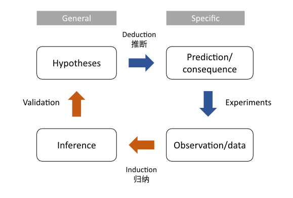
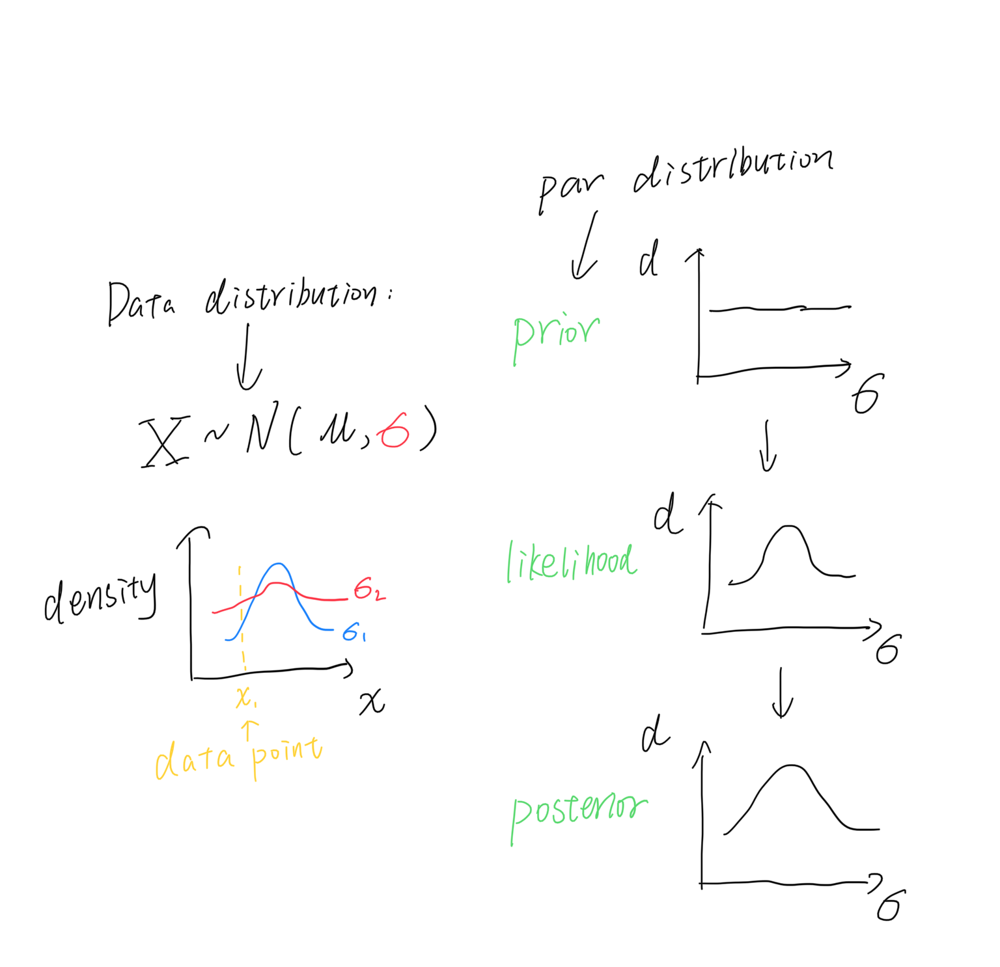

# Basics

## Conditional probability

Conditional probability is the probability of an event given something already happened. It is a joint probability divdied by marginal probability.

$$
P(A|B) = \frac{P(AB)}{P(B)}
$$

The `|` means "given".

## Bayesian theorem

Clearly $P(A|B)$ has some relationship with $P(B|A)$, someone called Bayes expressed this and invented his immortal theorem:

$$
P(A|B) = \frac{P(B|A)P(A)}{P(B|A)P(A) + P(B|!A)P(!A)}
$$

Bayesian theorem infers two things:

- The relationship between $P(A|B)$ and $P(B|A)$:
$$P(B|A)P(A)=P(A|B)P(A)$$

- Bayesian inference: 
If you are given something, you can find its reverse.

# Bayesian inference and science

## What is science?
Science refers to a system of acquiring knowledge. The scientific method consists of *induction* and *deduction* (see the figure below).

## Bayesian inference

We can slightly change the theorem in case there are more than two hypotheses:

$$
Pr(H_i|data) = \frac{\color{pink}{Pr(data|H_i)}\color{steelblue}Pr(H_i)}{\sum_{j=1}^n \color{pink}{Pr(data|H_i)}\color{steelblue}Pr(H_i)}
$$

$\color{pink}{Pr(data|H_i)}$ refers to $\color{pink}{likelihood}$, $\color{steelblue}Pr(H_i)$ refers to $\color{steelblue}{prior}$ probability, $Pr(A|B)$ refers to *posterior* probability.

If the probability is discrete, we use Pr(); otherwise, we use P() to represent the PDF distribution (and use integration to replace sum).

$$
P(\theta|data) = \frac{\color{pink}{P(data|\theta)}\color{steelblue}P(\theta)}{\int \color{pink}{P(data|\theta)}\color{steelblue}P(\theta)d\theta}
$$

The $\theta$ here refers to the single parameter in our PDF distribution. If there are two or more, simply change it.

 You might find the former one is regrading to hypothesis test, while the later one refer to parameter estimation. And due to its special feature, Bayesian inference always gives distribution. Thus the point estimation is not existing here and the interval estimation will be so easy to do.

In conclusion, Bayesian inference does work like below:

> Initial belief + New Data = Updated belief

This is why it is so important and relevant to science today.

# Do Bayesian analysis

## 1. Hypotheses

Hypotheses can be discrete or continuous. For example, we may estimate the $\mu$ (mean) of a normal distribution and assume it spans from 1 to 5 (Let us assume the $\sigma$, the variance, is known here).

## 2. (Parameter's) prior distribution

The parameter that we want to estimate is a random variable thus has its own distribution (and parameters). The parameter of $\theta$'s distribution is called *hyperparameter*. In another word, hyperparameter is the parameters of prior and posterior distribution.

The prior distribution has its name because it is condcuted before our data collection. You may wonder if the selection of prior influences the result, sadly it does. Thus a useful (informative) prior should be better selected. Otherwise, a non-informative prior will be used, e.g., uniform distribution or normal distribution. Here we know nothing and choose uniform distribution.

## 3. Collect data

A dataset might contain various dimensions. If they are independent, we can calculate likelihood by multiplication. Assume we have got one data point $x$.

## 4. Likelihood Profile

Likelihood is the conditional probability given data collected. It can be written in *$\mathcal{L}(x|\theta)$*, if we have the data $x$ already collected. Likelihood is different from probability because for the pdf distribution, the probability of one single point is always 0. Probability only refers to the integration area from $a$ to $b$, while likelihood is the $y$ value.

This step generates likelihood profile that describe the distribution of parameter. It is the *weights* (权重) of prior distribution and is the one updating our belief.

## 5. (Parameters's) posterior distribution

If we are estimating continuos distribution, then we have

1. prior distribution

2. likelihood profile (distribution)

Then we multiply them and calculate a new distribution: the posterior one! It describe the new proportion (density) of all hypotheses. So far the Bayesian analysis updates two things: (1) the distribution of data; (2) the distribution of parameter (or hypotheses) from prior to posterior.

But, you may notice the denominator of Bayes's theorem requires integration, which means in most cases we cannot calculate them directly!

## 6. A handnote summary!

# Conjugate shortcut

Some statisticians found in some limited cases we are able to calculate posterior distribution very easily and do not need simulation (no proof in this article!). They are:

- Beta prior + binomial data &rarr; beta posterior
- Gamma prior + Poisson data &rarr; beta posterior
- Normal prior + normal data &rarr; normal posterior
- Dirichlet prior + multinomial data &rarr; Dirichlet posterior

# MCMC to estimate posterior distribution

The integration often prevents us from calculating posterior distribution analytically. Thus we have simulation method - Markov Chain Monte Carlo (MCMC). Markov chain is to trace the state of variable which is relevant with the last one. Monte Carlo is a famous gambling city (and tax heaven and the venue of ATP 1000 Master where Rafa Nadal won his title for 11 times, OK I'm his fan :grin: ). Here we try parameters one by one (i.e. simulation) as a "chain".

## Metropolis algorithm

### How to do it?

- Choose a parameter value and calculate its likelihood

- Choose another one, do the same, and compare to the likelihood above

- Keep the parameter with smaller likelihood

- Repeat the steps above for as many times as possible

- All accepted values will be the points in (estimated) posterior distribution

- Update the hyperparameters using accepted values' mean/variance (so called *moment matching*) like connecting our points by a line.

### Questions

- Where should the parameter starts from? (termed as starting point)

- What is the rule of choosing next value? (termed as proposal distribution)

### Limitations

- The proposal distribution must be symmetrical (e.g., normal distribution)

- The distribution should be tuned so that the acceptance rate range between 20-50% (This is the limitation of entire MCMC method, not the algorithm's fault)

## Metropolis-Hastings algorithm

### Advantage
You can use Metropolis-Hastings algorithm when the proposal distribution is not symmetric. The only difference is the *correction factor* (the pink part):

$$
p_{move} = min\large(\frac{P(\theta_p|data)*\color{pink}{g(\theta_c|\theta_p)}}{P(\theta_c|data)*\color{pink}{g(\theta_p|\theta_c)}} ,1 \large)
$$

$p$ refers to "proposed value" and $c$ refers to "current value".

### What's the meaning of correction factor

It is the probability density of drawing the current value ($\theta_c$) from a distribution centering on proposed value ($\theta_p$) divided its reverse case. When the proposal distribution is symmetric, the factor equals 1:

$$
\frac{\color{pink}{g(\theta_c|\theta_p)}}{\color{pink}{g(\theta_p|\theta_c)}} = 1.0
$$

## Gibbs sampling algorithm

You may already find that our do not estimate the two parameters in our [first example](#do-bayesian-analysis). We will do it in this section! The specialty of Gibbs sampling reflects in its no limitation of the number of estimated parameters. Let's see it.

### Concrete steps

- Hypotheses two groups of hypermeters in prior distribution (one group for $\mu$, the other for $\sigma$)

- Choose a starting value of $\mu$ or $\sigma$, let's choose $\sigma$

- Update hyperparameters of $\mu$ based on known $\sigma$ value and conjugate method

- Now let's fix $\mu$, and update hyperparamters of $\sigma$

- Repeat $...$ and get their joint/marginal distribution

### Gibbs sampler

- BUGS (Bayesian inference Using Gibbs Sampling)
- JAGS (Just Another Gibbs Sampler)
- Stan

# MCMC diagnostic approaches

## Number of trials

Frequently, MCMC analyses use over 10,000 trials.

## Tuning parameter and acceptance rate

The acceptance rate cannot be too high or low. High acceptance rate means that most new samples occur just around the current value and not fully explore the parameter space. Low acceptance rate means most value are rejected and the chain does not move at all.

A reasonable acceptance ranges between 20~50%. We need to iteratively tune the proposal distribution to get a rate inside the interval. You can tune the parameter like Fig 14.7 in the reference book.

## Starting point and burn in

If a starting point is in a low density region of the posterior distribution, it also affects our result (especially in initial trials), although the markov chain will finally reach convergence. So we need to disregard some initial trials (e.g. 1000) before building posterior distribution. They may be too unstable to be used.

## Thinning/pruning

Disregard the certain number of trials, for example, every other trial, to avoid the correlation between nearby trials.

## Tiny number?

The computer store numbers in binary, e.g., 10 in decimal is 1010 in binary. Thus a number like the product of likelihood and prior density can be too small to be stored properly. We often calculate their logs in such cases.

## How to report MCMC result?

The credible interval of MCMC analysis is often reported. For example,minimum, maximum, 25/50/75 percentile, mean and variance.
