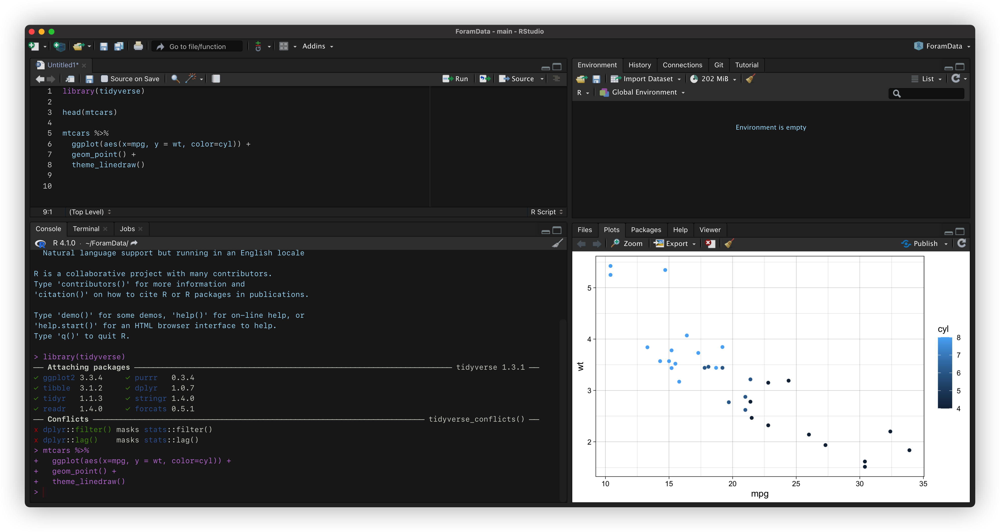

There's no doubt that Rstudio is the No.1 IDE in R world. However, it's intolerable that 
it doesn't support a good dark theme. Although one can choose some colour schemes by default,
you may still find the panel board is blue even if you have setted a "dark theme". And to be
honest, this has been a good reason for me to not use Rstudio: it is too ugly.

Yesterday I found a good package -- [darkstudio](https://github.com/rileytwo/darkstudio.git)
to solve this. In addition to [rscodeio](https://github.com/anthonynorth/rscodeio.git), it now
finally becomes sexy (The screenshot is done by iShot).

