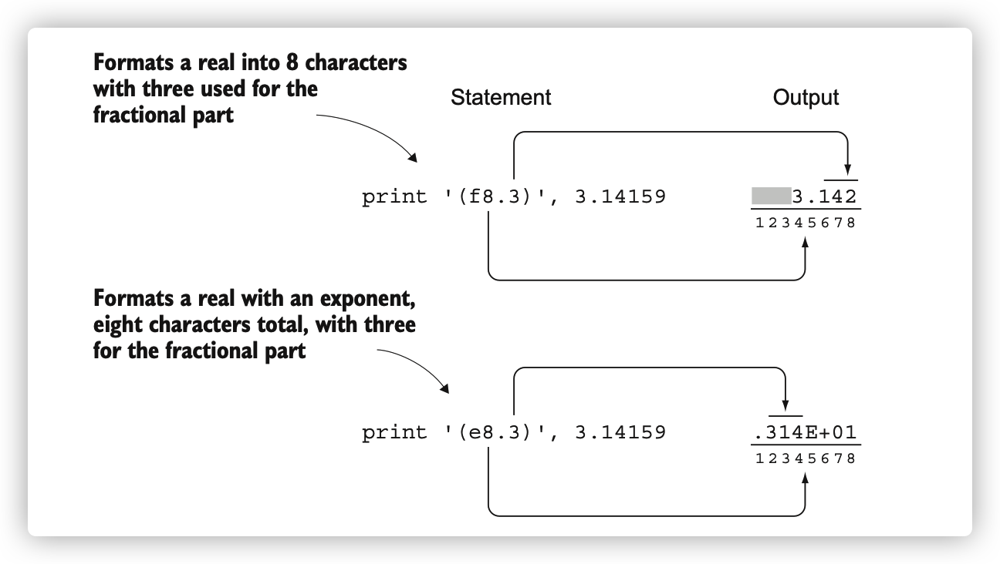
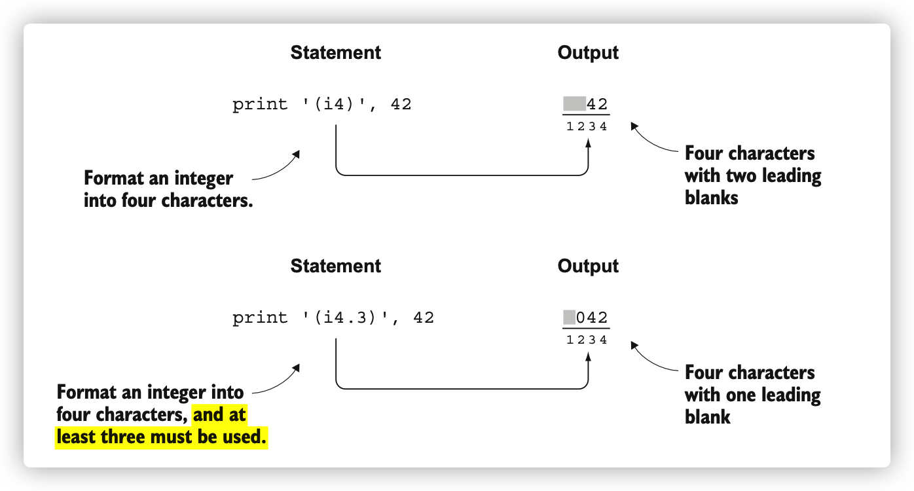

# Fortran Basics

## Data types and declaraion

* Character
* Real (same as **double** in C-series languages )
* Integer
* Complex
* Logical (.TRUE. and .FALSE.)

### Arrays

* Whole-array arithmetic (similar to some functional programming)
* Column major order/indexing (inherited by R/Matlab, unlike C/Python), therefore, a(1,1), a(2,1), a(3,1) will be faster to index.


```fortran
! ways to declare data
! Keyword `parameter` means immutable constant
integer, parameter :: a = 1, b = 2
! or
integer, parameter :: a, b
a = 1
b = 2

!character
character(len=4) :: first
character(5) :: last_name
! String concatenation
full_name = first_name//' '//last_name

! ways to declare arrays
real :: vec(10)
real, dimension(10,2) :: vec

!dynamic arrays, also called allocatable arrays
integer, allocatable :: a(:)

```

### Derived types

Derived types are "struct" in C/C++.

 A *derived type* is a special form of data type that can encapsulate other built-in types as well as other derived types

```fortran
!create a derived type
type :: t_pair
  integer :: x
  real :: y
end type

! use t_pair
type(t_pair) :: pair
pair%x = 1
pair%y = 0.1

! or do this at once
type(t_pair) :: pair
pair = t_pair(x=1, y=0.1)
```


### Implicit and explicit declaration

FORTRAN has a historical feature called implicit typing which allows variable types to be inferred by the compiler based on the first letter of the variable (stupid). Basically, any variable that began with I, J, K, L, M, or N was an integer, and it was a real (floating point) otherwise.

Anyway, always use `implict none` to override this stupid declaring!


## Structure

**Program:** Top-level unit that can be invoked only from the operating system. It contains sub-program as following.

**Function:** An executable subprogram that is invoked from expressions and **always returns a single result**. No side effects.can only call it from the main program or another procedure.

**Subroutine:** Modify multiple arguments in-place but can’t be used in expressions. Cause side effcts. (side effects can be prevented by **pure** statement)

**Module:** A **nonexecutable** collection of **variable**, **function**, and **subroutine** definitions (since F90). The variable declaration and procedure definition sections (function and subroutine) are separated with a **contains** statement.

**Submodule**: Extends an existing module and is used for defining variable and procedure definitions that only that module can access; useful for more complex apps and libraries

> In FORTRAN function/subroutine, dummy parameters are same as formal argument (形参) in other languages. In other languages, dummy arguments equals unused arguments.

> In subroutine, INTEND (IN):  indicating take value from outside and cannot be modified


> INTEND (OUT): indicating that their values will be computed and passed to the outside.

```fortran
! function always return a result
total = sum(1, 2)

! subroutine modifies input parameters
! and must be called by *call*
call add(a, 3)

! define module
module mod_test
end module mod_test

! like from xx import xx in Python
use mod_test, only: xxx
```

## IO

### Standard streams

Standard streams include standard input/output/error. 标准输入stdin是指从键盘输入，标准输出stdout是指输出到终端， 如printf, system.out.println(). 标准错误stderr是另外一种输出流，用于输出错误消息或诊断.

general I/O STATEMENTS

```fortran
READ(unit, format) item1, item2,...
WRITE(unit, format) item1, item2,...


! In many cases we use * which tell the compiler to use any format it likes
WRITE(*, *) item1, item2, ...
READ(*, *) item1, item2,...
```

> File handler: a identifier assigned to an open file that is currently being utilized by an operating system
>
> An I/O unit is like a **file handle** in other programming languages. It’s a unique identifier that’s assigned to a file when you open it.

The first asterisk `*` means the input comes from the **keyboard** in a READ statement and goes to the **screen** in a WRITE statement. The second asterisk (*) means the `free format` or `list-directed`: multiple variables in the sequence.


```fortran
program standard_streams
! => means alias
use iso_fortran_env, only: stdin => input_unit, stdout => output_unit, stderr => error_unit

implicit none
character(len=1000) :: text
read(stdin, '(a)') text
! trim() Remove trailing blank characters of a string
write(stdout, '(a)') trim(text)
write(stderr, '(a)') 'This is an error message'
end program standard_streams
```


### Format string

### Python

```python
# format specifier Python
# d -> integer; f -> float; s -> string
# use format or %
%4.2f
```

`%4.2f` means 4 characters at total, with 2 floating points.


### Fortran

```fortran
! format specifier is a string like '(e3.4)', the first letter means different data types and is surrounded by ()
! l -> logic, i -> integer, es -> exponential (scientific, 1.2E+02), en (engineering, 12E+01), g (any, OS-independent)

f4.3 -> float type, 4 character, three decimals

! integer: ix.y, x -> how many characters, y -> must use y characters (so add zeros if necessary)
i4.3 -> 42 to ` 042`

! Leading number -> apply the same format to multiple characters
2(f6.3) -> will cause no white space between these 2 values

! therefore we need manually inserat `spaces`, here 2x means 2 whitespaces
2(f6.3, 2x)

```



 **Legacy**: use ID to label and format statement (i.e. they are separated!)



### File IO

```fortran
open(unit, file=filename, action=“read/write/readwrite”, position='append/asis/rewind’),

! file unit is OS dependent and unknown ahead of time
! file unit is assigned only to one file before close. You can also determine the unit by yourself.

! 形参 `file =` can’t be omitted

! POSITION
! Rewinding -> start at the beginning
! asis -> begining if a fresh file, otherwise go to previous position
! append -> final position
```


#### writing file

```fortran
write(fileunit, format_string) , text
flush(fileunit) !flush the write buffer to the file
```


#### check existence of file

```fortran
logical :: file_existence

inquire(file=trim(filename), exist=file_exists)
```


#### Error handling keywords

Each of the `read`, `write`, `open`, `close`, `inquire`, `flush`, and `rewind` statements allows passing the `iostat` and `err` keyword parameters:

iostat = 0 if all good, otherwise positive

err—An integer error label to which the program will jump if the error is encountered

e.g. 

```fortran
write(fileunit, ‘(a)’, iostat = a_number, err=b_number)

! if error, the program jumps to here to close the file
b_number close(fileunit) 
```


TODO:

parallel fortran

compile and linking
