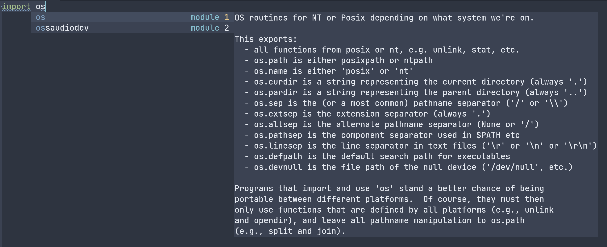

# Core packages
There're several packages to achieve functions as IDE or visual studio code: elpy, jedi and anaconda-mode are the most used. Jedi seems to be

## Prerequisites
Elpy requires some prerequisites, like Jedi, Rope and some others which you need to download through pip, the python package manager. You can check the list through `"M-x elpy-config"` and install them before using elpy properly. In this process, I've encountered a problem that even after downloading these packages I still cannot use elpy. This is because the installed packages are in `~/local/bin` and I didn't add it in PATH. the solution is either add it or use `sudo -H pip install`.

## Activiate Virtualenv
Elpy recommend to use virtualenv and you need to download Virtualenv through pip as well. Makedir to generate a new folder and use `virtualenv` command to create a virtualenv folder. Finally, use `M-x pyvenv-activate` to activate it.

## Company-quickhelp
Basically you can successfully use elpy after steps above. `C-c C-c` to send region to python interactive interpreter, `C-c C-d` to show documentation, `M-.` to go to definition. If you stop cursor at some point for a moment, the minibuffer will automatically show simple documentation. But we can use company-quickhelp to move it to a box. See the following snapshoot.

# My configuration and snapshoot
```lisp
(use-package elpy
  :init
  (elpy-enable)
  :config
  (setq python-shell-interpreter "ipython" ;require pip install ipython
	python-shell-interpreter-args "-i --simple-prompt")
  (add-hook 'python-mode-hook 'eldoc-mode)
  (setq elpy-rpc-python-command "python3")
  (setq elpy-shell-echo-output nil)
  (setq python-shell-completion-native-enable nil)
  (setq elpy-rpc-backend "jedi")
  (setq python-indent-offset 4
        python-indent 4)
  )

(use-package company-quickhelp
  :config
  (company-quickhelp-mode 1)
  (eval-after-load 'company
  '(define-key company-active-map (kbd "C-c h") #'company-quickhelp-manual-begin)))
```

